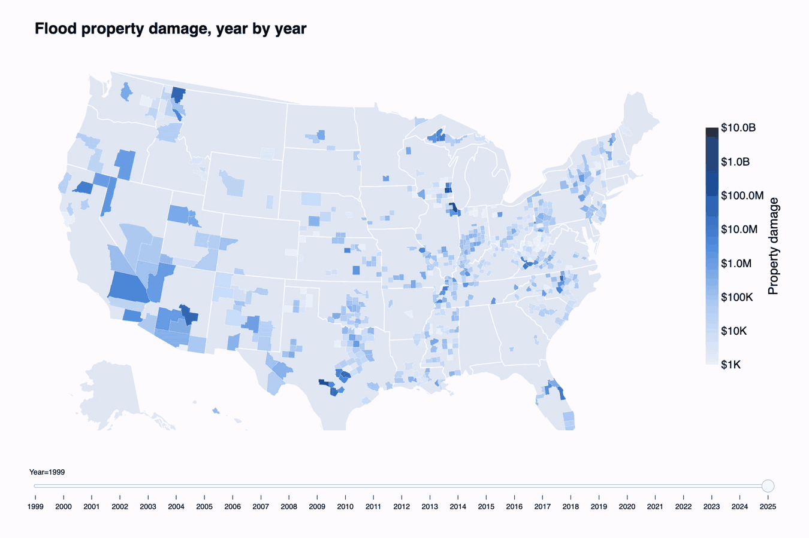
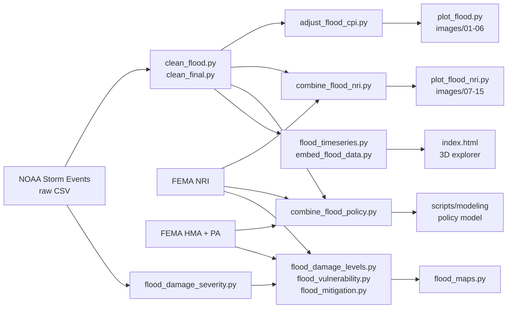

# Left in the Flood

**Where America's floods hit hardest, and where help never arrived.**

Carolina Data Challenge 2026 · Theme: *AI for Social Good*

[Devpost](TODO) · [Video demo](TODO) · [Slides](TODO) · [Live 3D explorer](TODO)



---

## Why this matters

Floods are the costliest recurring disaster in the United States. But the damage is not spread evenly,
and neither is the federal money meant to prevent the next flood. We combined 27 years of NOAA storm
records with FEMA's risk, vulnerability, and grant data to answer three questions:

1. **How bad does a flood get?** Which features of a flood (how many counties it hits, how deep, how long, what caused it) predict damage and deaths?
2. **Who gets hurt the most?** Do socially vulnerable counties lose more lives than similar floods elsewhere?
3. **Who gets help?** Does FEMA flood-mitigation money reach the counties with the most damage and the fewest resources?

We then trained a model that, for a given county and flood, estimates a likely range of federal
recovery funding and ranks the mitigation measures that similar counties have used.

## Key findings

All dollar figures are property damage in August 2026 dollars (CPI-U). Flood + Flash Flood events, 50 states + DC, 1999-2025, unless noted.

**Scale**
- **160,094** flood events in **51,765** flood episodes: **$159.1B** in recorded property damage and **2,366** direct deaths.

**Severity: the widest floods do almost all the damage**
- A flood episode that hits **16+ counties** averages **$71.9M** in damage, about **110x** a one-county flood ($654K).
- These wide floods are **2.6%** of episodes but **60%** of damage and **40%** of deaths.
- The costliest **1%** of events carry **92%** of all recorded flood damage.
- Flash floods are the killers: **1,762** deaths (17.9 per 1,000 events) vs 604 for river floods (9.8 per 1,000).
- Floods from tropical systems are **2.3%** of events but **43%** of damage.

**Vulnerability: the most vulnerable counties lose more lives**
- After holding state, flood type, and flood size fixed, counties in the most socially vulnerable fifth (FEMA NRI) record **1.15x** the flood deaths expected.
- NOAA-recorded damage is below FEMA's modelled expected annual flood loss in **99%** of counties (median county: **65x** lower). Recorded damage is a floor, not the full cost.

**Mitigation: help does not reach the counties that need it**
- **10,110** funded FEMA flood-mitigation projects (FY1999-2025) total **$13.0B** federal: about **9¢ of mitigation per $1 of recorded damage**.
- Among counties with flood damage, the most vulnerable fifth got at least one project **36%** of the time, vs **50-55%** for the least vulnerable (**0.84x** expected for their state and damage level).
- Only **19%** of the smallest counties got a project, vs **79%** of the largest. The gap tracks capacity to apply (staff, engineering studies, matching funds).
- **122 priority counties** combine top-25% flood damage, high social vulnerability, and under 1¢ of mitigation per $1 of damage. Examples: Tunica, MS ($1.5B damage, $0 mitigation), Inyo, CA ($664M, $0), Kerr, TX (118 flood deaths, $1.4M mitigation).

**Model**
- Recommending the top 2 mitigation measures for a county-year catches **84.5%** of the measures actually funded (frequency baseline: 81.9%); macro ROC-AUC **0.73** vs 0.50.
- The funding model gives an 80% range for federal recovery funding that is **36% narrower** than the baseline at similar coverage (78.6% vs 79.4%).

## What we built

| Part | What it does | Where |
|---|---|---|
| Data pipeline | Cleans raw NOAA Storm Events files, standardizes time zones, adjusts dollars for inflation, joins FEMA NRI and FEMA grant data by county | `scripts/clean_*.py`, `scripts/adjust_flood_cpi.py`, `scripts/combine_*.py` |
| 3D flood explorer | Interactive web map (Mapbox + deck.gl): 3D columns of flood loss by location, year slider with play button, click to zoom in | `index.html` |
| Severity analysis | Damage and deaths by flood footprint, extent, depth, duration, and cause | `scripts/flood_damage_severity.py`, `scripts/flood_damage_levels.py` |
| Vulnerability analysis | Flood deaths vs FEMA social vulnerability; NOAA recorded loss vs FEMA modelled loss | `scripts/flood_vulnerability.py`, `scripts/plot_flood_nri.py` |
| Funding gap analysis | Who gets FEMA flood-mitigation money; 122 priority counties | `scripts/flood_mitigation.py` |
| County maps | Interactive county maps (HTML), including the year-by-year map shown in the GIF above | `scripts/flood_maps.py` |
| County risk lookup | Search a county and see its FEMA NRI flood risk level | `scripts/county_search_level.ipynb` |
| Policy model | Predicts a federal funding range and ranks mitigation measures for a county, flood type, and impact level | `scripts/modeling/` |

## Data sources

| Dataset | Publisher | Used for |
|---|---|---|
| [Storm Events Database](https://www.ncei.noaa.gov/stormevents/) ([bulk CSV](https://www.ncei.noaa.gov/pub/data/swdi/stormevents/csvfiles/)) | NOAA NCEI | Flood events, damage, deaths, locations, narratives |
| [National Risk Index, county table](https://hazards.fema.gov/nri/data-resources) | FEMA | Social vulnerability, community resilience, modelled flood risk and expected annual loss |
| [Hazard Mitigation Assistance Projects v4](https://www.fema.gov/openfema-data-page/hazard-mitigation-assistance-projects-v4) | OpenFEMA | Flood-mitigation projects and federal funding |
| [Public Assistance Funded Projects Details v1](https://www.fema.gov/openfema-data-page/public-assistance-funded-projects-details-v1) | OpenFEMA | Federal recovery funding after declared disasters (model target) |
| [CPI-U, CPIAUCSL](https://fred.stlouisfed.org/series/CPIAUCSL) | BLS via FRED | Inflation adjustment to August 2026 dollars |
| [US county boundaries (GeoJSON)](https://github.com/plotly/datasets/blob/master/geojson-counties-fips.json) | Plotly datasets | County maps |

## How the pieces fit



## Repository layout

```
.
├── index.html                    3D flood explorer (open in a browser)
├── flood_data_embedded.js        Data for index.html (generated)
├── flood_timeseries.py           Builds the explorer's yearly time series
├── scripts/
│   ├── clean_flood.py            Raw NOAA files -> one flood table per year
│   ├── clean_final.py            Time zones -> EST, final validation
│   ├── adjust_flood_cpi.py       Inflation adjustment (CPI-U)
│   ├── combine_flood_nri.py      Join floods with FEMA NRI by county
│   ├── combine_flood_policy.py   County-year table: floods + NRI + FEMA grants
│   ├── plot_flood.py             Charts images/01-06
│   ├── plot_flood_nri.py         Charts images/07-15
│   ├── embed_flood_data.py       Rebuilds flood_data_embedded.js
│   ├── county_search_level.ipynb County risk lookup
│   ├── flood_damage_severity.py  Severity analysis
│   ├── flood_damage_levels.py    Flood levels L1-L5
│   ├── flood_vulnerability.py    Deaths vs social vulnerability
│   ├── flood_mitigation.py       FEMA mitigation funding gap
│   ├── flood_maps.py             Interactive county maps
│   └── modeling/                 Policy model (see scripts/modeling/README.md)
├── data/
│   ├── analyzed_data/            Joined tables, data dictionaries, metadata
│   └── modeling/                 Train/validation/test splits, trained model, metrics
├── images/                       Charts from plot_flood.py and plot_flood_nri.py
└── outputs/                      Findings, tables, charts, and maps from the flood_*.py scripts
```

## How to reproduce

Requires Python 3.9+.

```bash
pip install pandas numpy matplotlib plotly scikit-learn joblib pillow
```

**1. Get the raw data** (large files are not in the repo)

- NOAA Storm Events: download the `StormEvents_details`, `StormEvents_fatalities`, and `StormEvents_locations` files for 1996-2026 from the [bulk CSV folder](https://www.ncei.noaa.gov/pub/data/swdi/stormevents/csvfiles/) and unzip them into `data/Archive/`.
- OpenFEMA Public Assistance Funded Projects Details: save as `PublicAssistanceFundedProjectsDetails.csv` in the repo root.
- FEMA NRI county table, HMA projects, and CPI are already in the repo root.

**2. Cleaning and joins**

```bash
python3 scripts/clean_flood.py
python3 scripts/clean_final.py
python3 scripts/adjust_flood_cpi.py
python3 scripts/combine_flood_nri.py
python3 scripts/combine_flood_policy.py
python3 scripts/plot_flood.py
python3 scripts/plot_flood_nri.py
```

**3. Severity, vulnerability, and funding analysis**

```bash
python3 scripts/flood_damage_severity.py --raw-dir data/Archive   # writes outputs/flood_severity/flood_events.csv.gz used below
python3 scripts/flood_damage_levels.py
python3 scripts/flood_vulnerability.py
python3 scripts/flood_mitigation.py
python3 scripts/flood_maps.py                 # downloads county shapes on the first run
```

Each script writes a `FINDINGS.md`, tables, and figures to its folder in `outputs/`.

**4. Policy model**

```bash
pip install -r scripts/modeling/requirements.txt
python3 scripts/modeling/split_data.py
python3 scripts/modeling/train.py
python3 scripts/modeling/export_summary.py
python3 scripts/modeling/plot_metrics.py
python3 scripts/modeling/predict.py --county-fips 37155 --flood-type "Flash Flood" --impact-level severe
```

**5. 3D explorer**

Open `index.html` in a browser. The data is embedded, so no server is needed. The basemap needs a
Mapbox public token: add `?token=pk....` to the URL or paste one when prompted.
To rebuild the data: `python3 flood_timeseries.py && python3 scripts/embed_flood_data.py`.

## Methods in brief

- **Inflation:** every event's damage is converted to August 2026 dollars with monthly CPI-U. October 2025 CPI is missing (federal data gap), so it is interpolated from neighboring months.
- **Flood size (severity levels):** NOAA groups related reports into episodes. We count how many counties one episode touches: L1 = 1 county, L2 = 2-3, L3 = 4-7, L4 = 8-15, L5 = 16+.
- **Expected vs recorded:** "1.15x expected deaths" and "0.84x expected access" compare each county group against counties in the same state with the same flood type and similar flood size or damage.
- **Flood-mitigation projects:** FEMA HMA projects coded as acquisition, relocation, elevation, floodproofing, drainage, flood control, or floodplain restoration, plus all Flood Mitigation Assistance, Severe Repetitive Loss, and Repetitive Flood Claims projects, with an approved, obligated, or closed status.
- **Model:** counties (not rows) are split 70/15/15 into train, validation, and test, so no county appears in two sets. Funding uses elastic-net regression with calibrated 80% intervals. Measure ranking uses logistic regression. Both are compared against simple baselines and checked with 3-fold cross-validation by county.

## Limitations

- **NOAA damage is an estimate and often blank.** Before 2007 about 62% of flood records have no damage value, so the severity analysis leans on 2007-2025. Recorded damage is far below FEMA's modelled loss and should be read as a lower bound.
- **Different scopes give different totals.** The $159.1B headline covers Flood + Flash Flood, 1999-2025. The joined NRI tables in `data/analyzed_data/` also include Coastal and Lakeshore floods and 1998 records, so their totals are higher.
- **County matching is incomplete.** About 30% of pre-2007 flood records use NWS forecast zones rather than counties, and Connecticut's switch to planning regions breaks the NRI join there. These records are excluded from county-level results.
- **Associations, not causes.** Vulnerability and funding gaps are measured relative to similar counties, but other factors can still explain part of them.
- **The model learns past decisions.** Its recommendations rank what counties like this one have been funded for, not what works best, and are not a guarantee of eligibility.
- **Snapshots.** FEMA NRI is one recent snapshot applied to all years. OpenFEMA data were downloaded in 2026 and are updated over time.

## Team

| Member | Contributions |
|---|---|
| Vicky Ma | Data cleaning, county risk lookup, slides and presentation |
| Ouwen (Owen) Li | NOAA + FEMA data joins, policy model (funding range and mitigation measure ranking) |
| Weili (Eric) Luo | Visualization: 3D flood explorer web app, video demo |
| Zhenhao (Leo) Yang | Flood severity analysis, social vulnerability and FEMA mitigation funding gap, county maps, README |

## License

[MIT](LICENSE)
